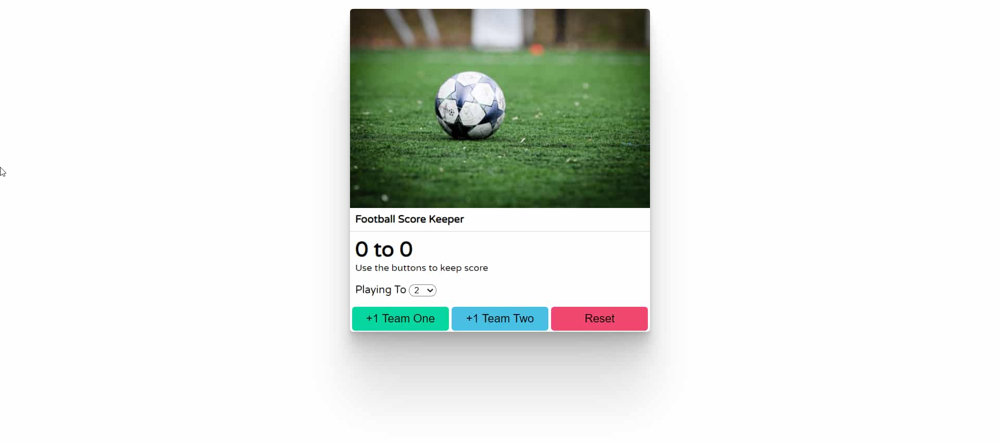

# Footbal Score Keeper

Access the site &rArr; [here](https://ashwin776.github.io/JS-Projects/08.%20Football%20Score%20Keeper/)

---
## Features & Working

* Dynamic Scoreboard
* Dropdown will accept the winning Score (max is 10)
* There are 3 buttons
    1. +1 Team One &rArr; Adds 1 point to Team 1 Score
    2. +2 Team Two &rArr; Adds 1 point to Team 2 Score
    3. Reset &rArr; Resets the score of both teams to 0
* When a team attains the winning score, buttons ('+1 Team one' and '+1 Team two') are disabled, and scoreboard colors are changed accordingly.
* To restart,
    * Press Reset
    * Change the Winning Score

