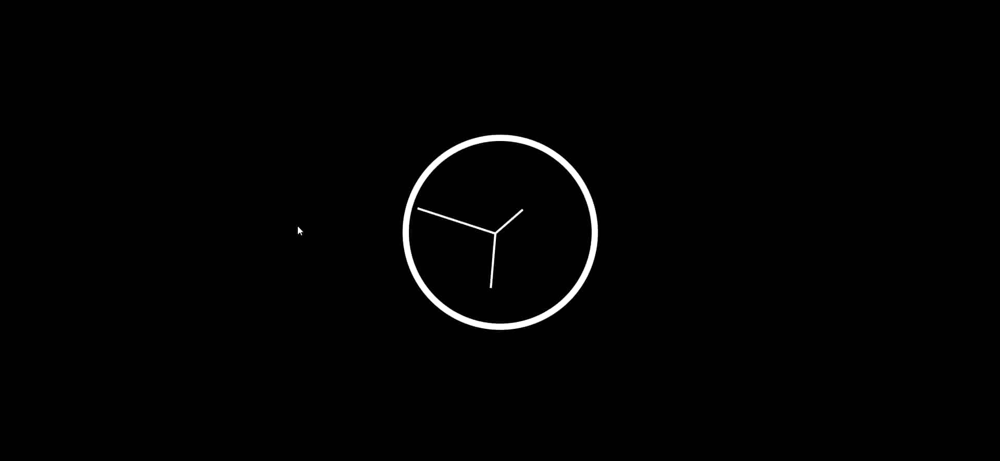

# CSS & JS Clock - #Javascript30(Day - 2)

Access the site &rArr; [here](https://ashwin776.github.io/JS-Projects/10.%20JS%2030%20-%20Day2%20-%20CSS-JS%20Clock/)

---

## Things I learned

1. Using **rotate()** function in CSS
2. Making a **Clock** in HTML and CSS
3. Introducing the clock ticking feature using **setInterval()** - JS and rotate() - CSS