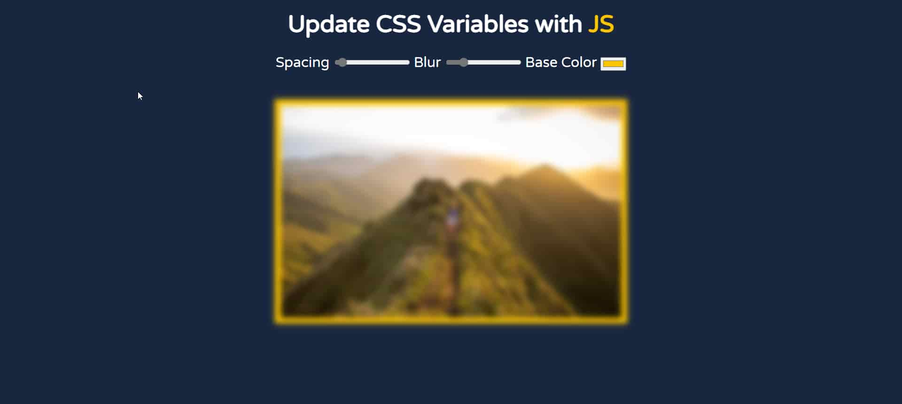

# Update CSS Variables with JS - #Javascript30(Day - 3)

Access the site &rArr; [here](https://ashwin776.github.io/JS-Projects/11.%20JS30%20-%20Day3%20-%20Update%20CSS%20variables%20with%20JS/)

---

## Things I learned

1. CSS Variables
    * Selecting / Updating CSS variables using JS

2. Selecting the root element in JS using <code>document.documentELement</code>

## Features to Add

- [ ] By clicking a button, one can see the values of **blur**, **spacing** and **base-color**
- [ ] Add **more CSS to the image** which can be inturn edited by the user
- [ ] By clicking a button, one can **download the underlying CSS** on the img element 