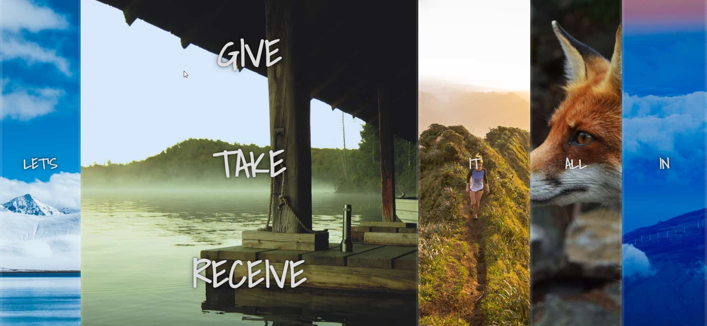

# Flex Panels Image Gallery - #Javascript30(Day - 5)

Access the site &rArr; [here](https://ashwin776.github.io/JS-Projects/13.%20JS30%20-%20Day5%20-%20Flex%20Panels%20Image%20Gallery/)

---
## Things I learned

1. More Practice on: 
    * `"transitionend"` events
    * `"click"` events
    * CSS transitions 
    * CSS transforms
2. Checking the `propertyName` of the Event Object during a `"transitionend"` event is **important**.(Read the comments in app.js)

## Features to Add

- [ ]  Panel(opened) should shrink if any other panel is clicked. 
