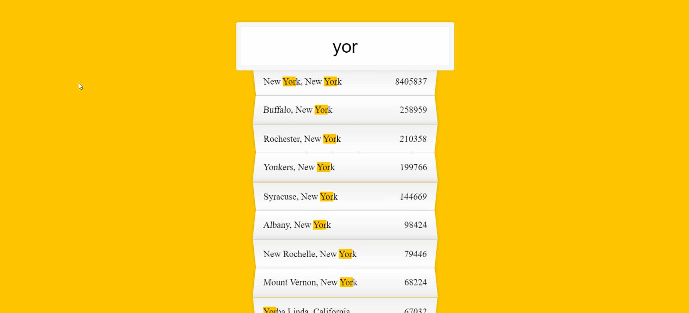

# AJAX Type Ahead - #Javascript30(Day - 6)

Access the site &rArr; [here](https://ashwin776.github.io/JS-Projects/14.%20JS30%20-%20Day6%20-%20AJAX%20Type%20Ahead/)
API endpoint used &rArr; [here](https://gist.githubusercontent.com/Miserlou/c5cd8364bf9b2420bb29/raw/2bf258763cdddd704f8ffd3ea9a3e81d25e2c6f6/cities.json)

---

## Things I learned

1. Getting Data from API endpoints
2. Searching on API data
3. Regex
4. Practice on Array methods