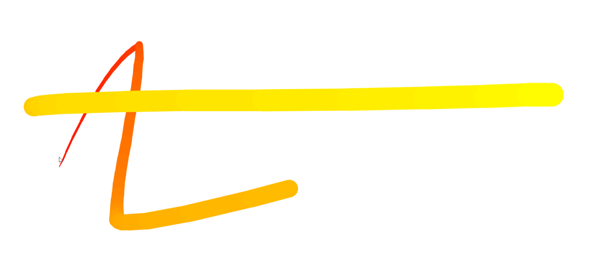

# Fun with HTML Canvas - #Javascript30(Day - 8)

Access the site &rArr; [here](https://ashwin776.github.io/JS-Projects/17.%20JS30%20-%20Day8%20-%20Fun%20With%20HTML%20Canvas/)\
Reference &rArr; 
1. [Mdn](https://developer.mozilla.org/en-US/docs/Web/API/Element/mousemove_event)
2. [video](https://www.youtube.com/watch?v=gm1QtePAYTM)

---

## Things I learned

- Using HTML Canvas API