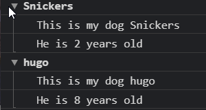

# 14 Must Know Dev Tools Tricks - #Javascript30(Day - 9)

## Things I learned

- Console.log statements

    **1. Regular**

    ```javascript
    console.log("Hello"); // Hello
    ```

    **2. Interpolated**

    ```javascript
    console.log("This is a %s", "STRING"); // This is a STRING
    ```

    As now we use ES6 backticks(`), so
    ```javascript
    let string = "STRING";
    console.log(`This is a ${string}`); // This is a STRING
    ```

    **3. Styled** : Use `%c`

    ```javascript
    console.log("%c This is a great text", "font-size: 30px;background-color: red;"); // The styles get applied
    ```

    **4. Warning**

    ```javascript
    console.warn("OOPS"); // Self Explanatory
    ```
    **5. Error**

    ```javascript
    console.error("Something went wrong");
    ```

    **6. Info**

    ```javascript
    console.info("Dammit Peanut Butter is the best!");
    ```

    **7. Testing**

    ```javascript
    console.assert(2 == 1, "That is Wrong!"); // This will give an assertion failed error with "That is wrong" as the error Text   
    ```

    **8. Clearing**

    ```javascript
    console.clear(); // Will clear the console
    ```

    **9. Viewing DOM elements**

    ```javascript
    const p = document.querySelector("p");
    console.dir(p); // will show all the properties and method p - DOM element, has.
    ```

    **10. Grouping things together**

    ```javascript
    const dogs = [{ name: 'Snickers', age: 2 }, { name: 'hugo', age: 8 }];

    dogs.forEach(dog => {
        console.group(dog.name);
        console.log(`This is my dog ${dog.name}`);
        console.log(`He is ${dog.age} years old`);
        console.groupEnd(dog.name);
    });
    ```
    Output : \
    ;

    **11. Counting** : `console.count()` logs the number of times that this particular call to count() has been called.

    ```javascript
    console.count("Ashwin"); // Ashwin : 1
    console.count("Ashwin"); // Ashwin : 2
    console.count("Webber"); // Webber : 1
    console.count("Webber"); // Webber : 2
    ```

    **12. Timing** : `console.time()` method starts a timer you can use to track how long an operation takes. (You can use [`performance.now()`](https://developer.mozilla.org/en-US/docs/Web/API/Performance/now) too)

    ```javascript
    console.time("Fetching data");
    doSomething();
    console.timeEnd("Fetching data");
    ```