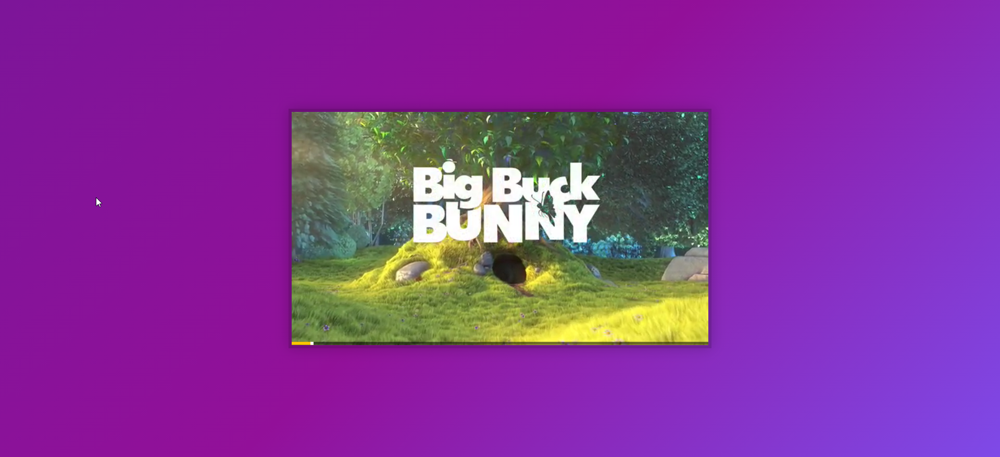

# Custom HTML5 Video Player

Access the site &rArr; [here](https://ashwin776.github.io/JS-Projects/20.%20JS30%20-%20Day11%20-%20Custom%20HTML5%20Video%20Player/)

---

## Things I learned

- `<video>` DOM object contains all the required controls needed for a video player like:
( Consider : `const video = document.querySelector("video");`) 
    - `video.duration`
    - `video.playbackRate`
    - `video.currentTime`

- For `click` events `offsetX`and `offsetY` properties of the event object gives the mouse coordinates relative to the element (doesn't include the padding).
- `timeupdate` event fires up when `video.currentTime` changes - This can be used to update the progressBar instead of setIntervals, because the latter fires up even when the video is paused.

## Todos

- [ ] Include a button for making the video full screen.
- [ ] Slider can be dragged.
- [ ] Moving the slider, adjusting volume and playbackRate using arrow keys