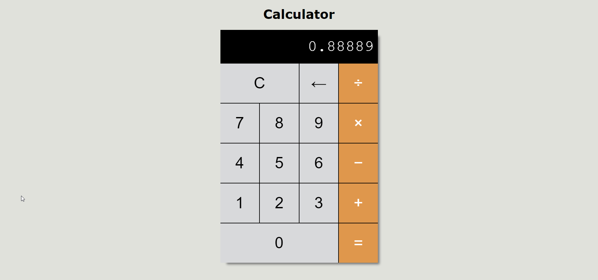

# Calculator Project

Access the site &rArr; [here](https://ashwin776.github.io/JS-Projects/21.%20Calculator)

### Todos
- [ ] Think about more validations
- [ ] Code an animation which activates when a number is divided by 0 or something happens that "breaks" the calculator.
- [ ] Font-size of the answer should decrease if it has more decimal digits - (show max decimal digits)