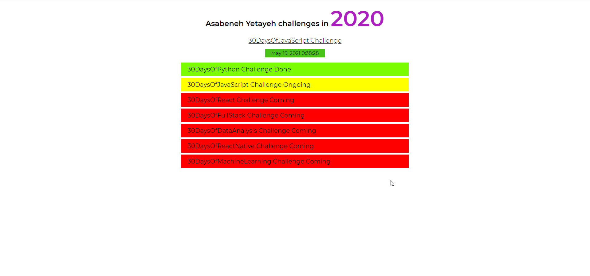

## THINGS I LEARNED

1. Basics of **DOM**
    * Getting Elements
    * Adding Attributes
    * Adding Text
    * Adding / Manipulating Styles
2. Using **setInterval()**
3. How to make a **digital Clock in Javascript**